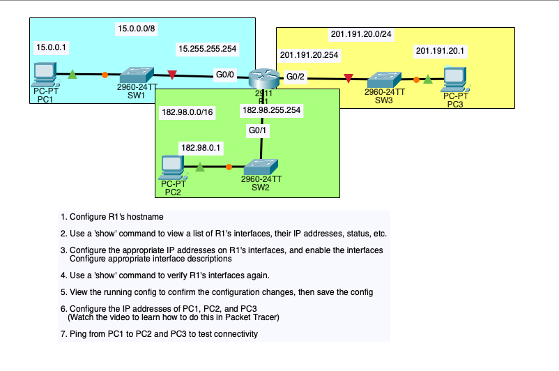
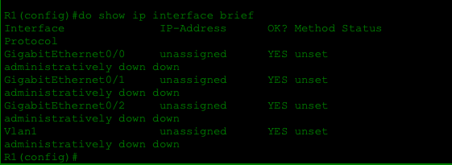
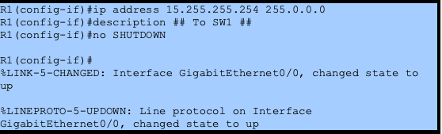
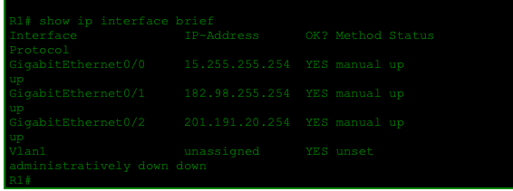
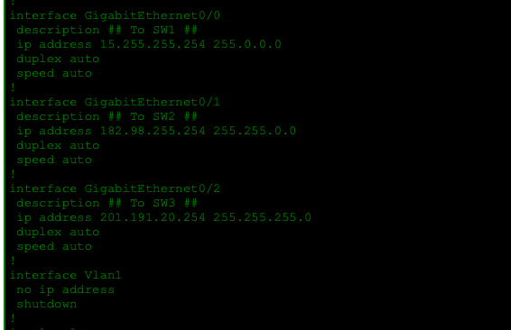
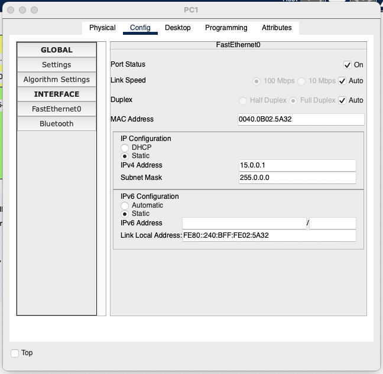
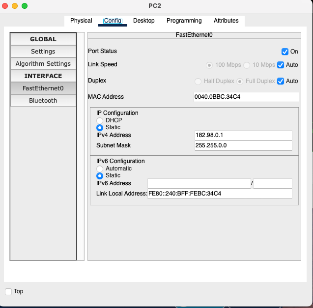
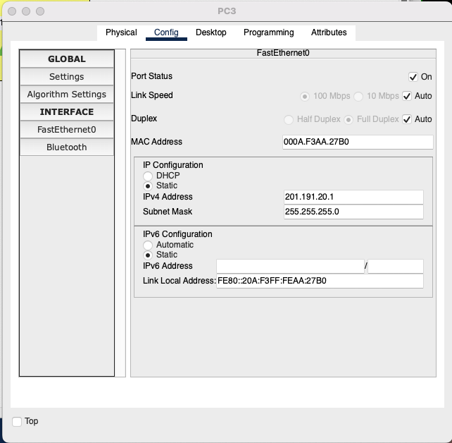
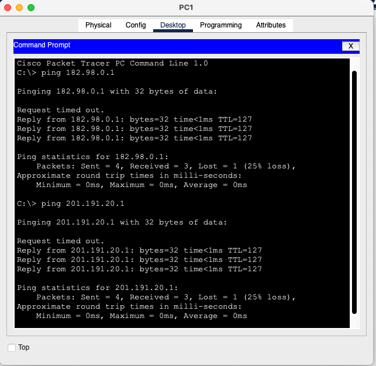

# 🧪 CCNA Lab: Router Interface Configuration & Inter-Network Connectivity

This lab focuses on configuring a router with multiple interfaces, assigning IP addresses to different networks, and verifying end-to-end connectivity between hosts across **multiple subnets** using static IP addressing.

---

## 🖧 Network Topology & Lab Objectives

### Topology Overview
- **Router:** R1
- **Switches:** SW1, SW2, SW3
- **PCs:** PC1, PC2, PC3
- **Networks:**
  - `15.0.0.0/8` (PC1)
  - `182.98.0.0/16` (PC2)
  - `201.191.20.0/24` (PC3)

### Lab Objectives
1. Configure R1 hostname  
2. View router interfaces and their status  
3. Assign IP addresses to router interfaces  
4. Enable router interfaces and add descriptions  
5. Verify configuration using show commands  
6. Configure static IPs on PCs  
7. Test connectivity using ping  

---

## 1️⃣ PC IP Configuration (Static Addressing)

### PC1 Configuration

- IP Address: `15.0.0.1`
- Subnet Mask: `255.0.0.0`
- Default gateway provided by R1 interface

---

### PC2 Configuration

- IP Address: `182.98.0.1`
- Subnet Mask: `255.255.0.0`

---

### PC3 Configuration

- IP Address: `201.191.20.1`
- Subnet Mask: `255.255.255.0`

---

## 2️⃣ Router Interface Configuration

### Assigning IP Addresses & Descriptions

R1 was configured with three GigabitEthernet interfaces:

- **G0/0 → SW1**
  - IP: `15.255.255.254 /8`
- **G0/1 → SW2**
  - IP: `182.98.255.254 /16`
- **G0/2 → SW3**
  - IP: `201.191.20.254 /24`

Each interface was also given a **description** to clearly document its connection.

---

## 3️⃣ Enabling Router Interfaces

- Interfaces are **administratively down by default**
- `no shutdown` was issued on each interface
- Console messages confirm:
  - Physical link is up
  - Line protocol is up

---

## 4️⃣ Verification Using Show Commands

### Common Mistake: Running Show Command in Config Mode

- `show ip interface brief` does **not work in config mode**
- Must be executed from **privileged EXEC mode**

---

### Successful Verification

- All three GigabitEthernet interfaces are:
  - **UP / UP**
  - Assigned correct IP addresses
- Confirms router is ready to forward traffic between networks

---

## 5️⃣ End-to-End Connectivity Testing

From **PC1**, pings were sent to:
- `182.98.0.1` (PC2)
- `201.191.20.1` (PC3)

### Observations
- First ping times out due to ARP resolution
- Subsequent replies succeed
- Confirms **inter-network routing is functioning correctly**

---

## 📊 Commands Learned & Used

| Command | Mode | Purpose |
|------|------|------|
| `enable` | User EXEC | Enter privileged mode |
| `configure terminal` | Privileged EXEC | Enter global config mode |
| `hostname R1` | Global Config | Set router hostname |
| `interface gigabitEthernet 0/x` | Global Config | Enter interface config mode |
| `ip address X.X.X.X Y.Y.Y.Y` | Interface Config | Assign IP address to interface |
| `description` | Interface Config | Document interface purpose |
| `no shutdown` | Interface Config | Enable interface |
| `show ip interface brief` | Privileged EXEC | Verify interface status & IPs |
| `show running-config` | Privileged EXEC | Verify saved configuration |
| `ping` | PC / Router | Test Layer 3 connectivity |

---

## 📚 Skills Learned

`Router Configuration` `Inter-Network Routing` `IPv4 Addressing`
`Subnetting (/8 /16 /24)` `Cisco IOS Navigation`
`Interface Configuration` `No Shutdown`
`Show Commands` `Ping & ARP Behavior`
`Packet Tracer Troubleshooting`
`Layer 3 Connectivity`

---

## ✅ Key Takeaways

- Routers enable communication between **different IP networks**
- Interfaces must be **configured and enabled** to forward traffic
- `show ip interface brief` is essential for quick verification
- Initial ping failures are normal due to ARP
- Clear interface descriptions improve network documentation

---

📌 **This lab reinforces core CCNA routing fundamentals and practical IOS workflow used in real networking environments.**
