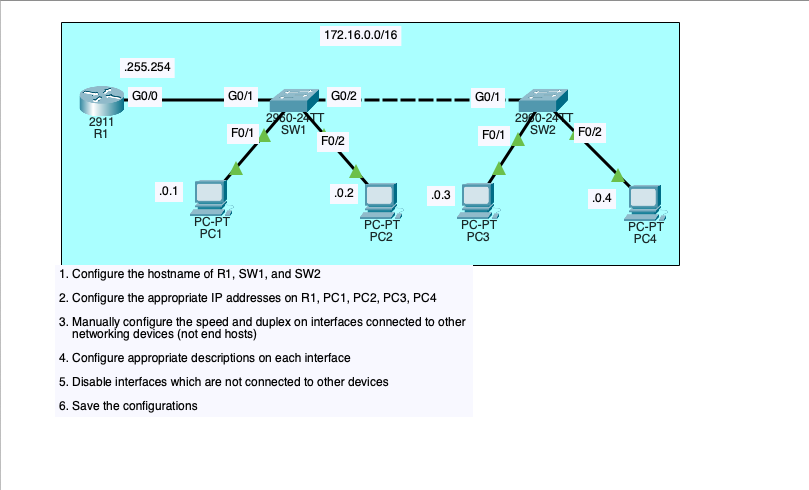
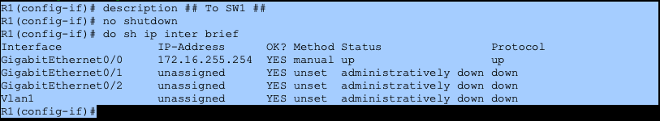
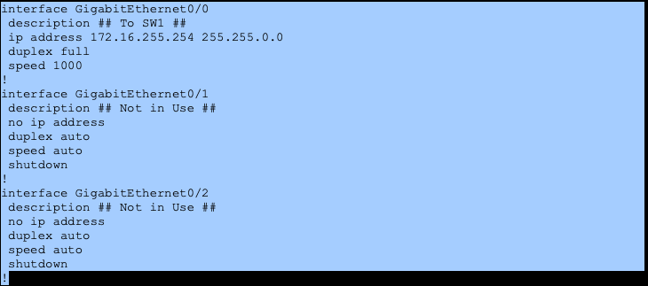
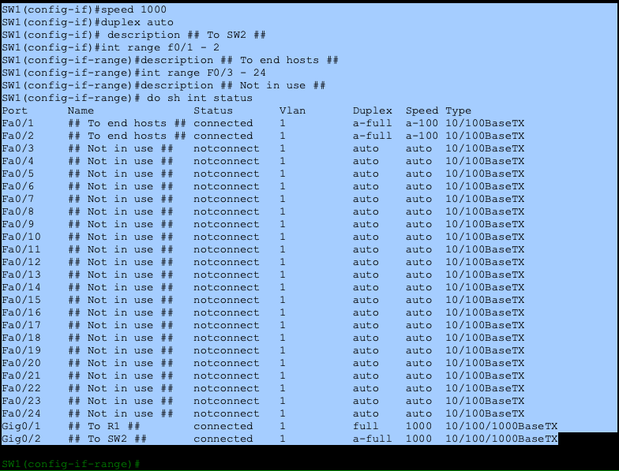
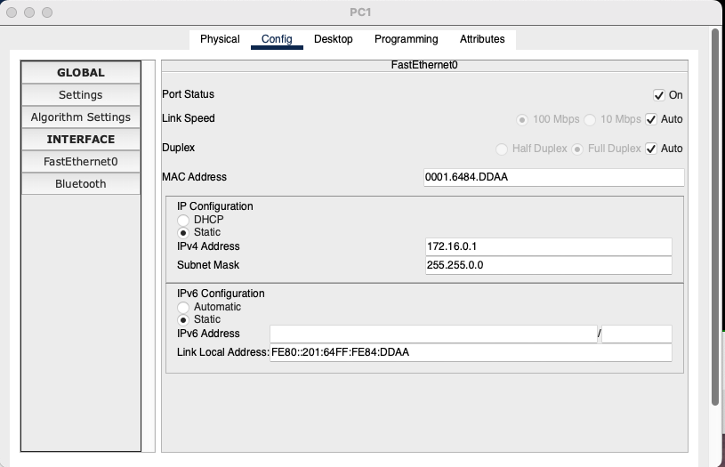
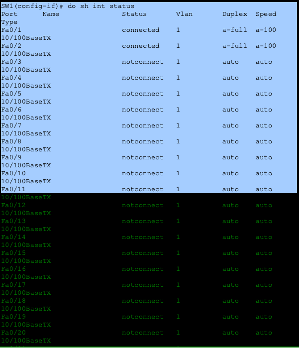
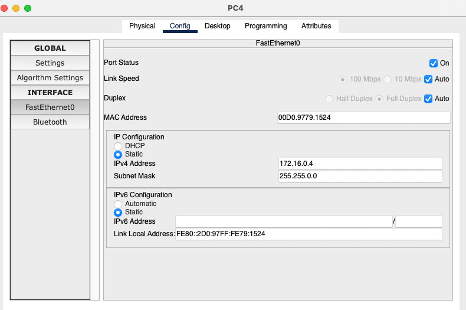
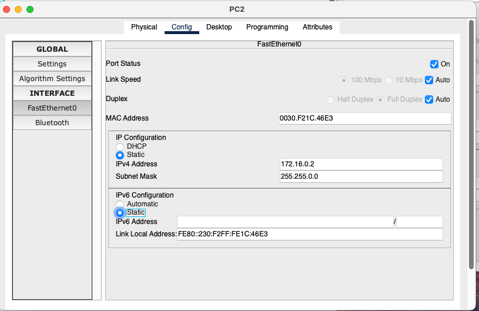
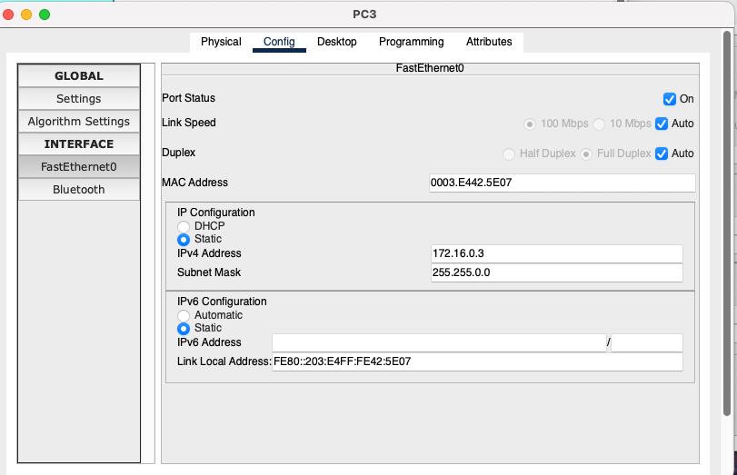

# 🧪 CCNA Lab: Interface Configuration, Speed/Duplex, and Port Management

This lab focuses on configuring router and switch interfaces in a flat Layer 2 / Layer 3 network, manually setting **speed and duplex**, applying **interface descriptions**, disabling unused interfaces, and verifying interface status using Cisco IOS show commands.

The goal is to practice **real-world interface hygiene** and verification rather than just basic connectivity.

---

## 🖧 Network Topology & Lab Tasks

### Addressing
- Network: `172.16.0.0 /16`
- Router default gateway: `172.16.255.254`
- Hosts:
  - PC1: `172.16.0.1`
  - PC2: `172.16.0.2`
  - PC3: `172.16.0.3`
  - PC4: `172.16.0.4`

### Lab Tasks
1. Configure hostnames on R1, SW1, and SW2  
2. Assign IP addresses to R1 and all PCs  
3. Manually configure **speed and duplex** on connected interfaces  
4. Apply meaningful **interface descriptions**  
5. Disable interfaces not in use  
6. Verify and save configurations  

---

## 1️⃣ Router Interface Configuration

On R1:
- `GigabitEthernet0/0` was configured with:
  - IP address `172.16.255.254 /16`
  - Manual speed and duplex
  - Description indicating connection to SW1
- Unused interfaces were explicitly configured and shut down to avoid ambiguity

---

## 2️⃣ Enabling Interfaces and Initial Verification

- Router interfaces are **administratively down by default**
- `no shutdown` was applied to the active interface
- Interface and line protocol transitioned to **up**

---

## 3️⃣ Disabling Unused Router Interfaces

- Interfaces not connected to any device were:
  - Given a `## Not in Use ##` description
  - Administratively shut down
- This reflects real operational best practices

---

## 4️⃣ Switch Interface Speed, Duplex, and Descriptions (SW1)

On SW1:
- Gigabit interfaces connecting to R1 and SW2 were manually set:
  - `speed 1000`
  - `duplex full`
- Interface descriptions clearly document upstream/downstream connections
- An invalid input error is shown when an unsupported command is attempted, reinforcing IOS command context awareness

---

## 5️⃣ Bulk Interface Configuration with Interface Ranges

- `interface range` was used to efficiently:
  - Label end-host ports
  - Mark unused ports
- This demonstrates scalable configuration techniques instead of per-port changes

---

## 6️⃣ Switch Interface Status Verification (SW1)

- `show interfaces status` confirms:
  - Which ports are connected vs not connected
  - Negotiated speed and duplex
  - Interface naming consistency

---

## 7️⃣ Switch Interface Status Verification (SW2)

- Unused access ports were **disabled**
- Active ports show correct operational status
- Confirms consistent configuration across multiple switches

---

## 8️⃣ Host IP Configuration

### PC1

- IP: `172.16.0.1 /16`

### PC2

- IP: `172.16.0.2 /16`

### PC3

- IP: `172.16.0.3 /16`

### PC4

- IP: `172.16.0.4 /16`

---

## 📊 Commands Learned & Used

| Command | Device | Purpose |
|------|------|------|
| `hostname` | Router / Switch | Set device identity |
| `interface gigabitEthernet` | Router / Switch | Enter interface configuration mode |
| `ip address` | Router | Assign IPv4 address |
| `speed` | Router / Switch | Manually configure interface speed |
| `duplex` | Router / Switch | Manually configure duplex mode |
| `description` | Router / Switch | Document interface purpose |
| `no shutdown` | Router / Switch | Enable interface |
| `shutdown` | Router / Switch | Disable unused interfaces |
| `interface range` | Switch | Configure multiple interfaces at once |
| `show ip interface brief` | Router | Verify IPs and interface state |
| `show interfaces status` | Switch | Verify port status, speed, duplex |

---

## 📚 Skills Learned

`Cisco IOS` `Interface Configuration`
`Speed & Duplex Control`
`Interface Descriptions`
`Disabling Unused Ports`
`Interface Ranges`
`Operational Verification`
`show Commands`
`Layer 2 & Layer 3 Fundamentals`
`Network Hygiene Best Practices`
`Packet Tracer Troubleshooting`

---

## ✅ Key Takeaways

- Manual speed/duplex configuration prevents negotiation issues
- Interface descriptions improve long-term maintainability
- Unused ports should always be disabled
- `interface range` enables scalable switch configuration
- Verification commands are as important as configuration commands

---

📌 *This lab reinforces practical interface management and verification skills used daily by network engineers.*

