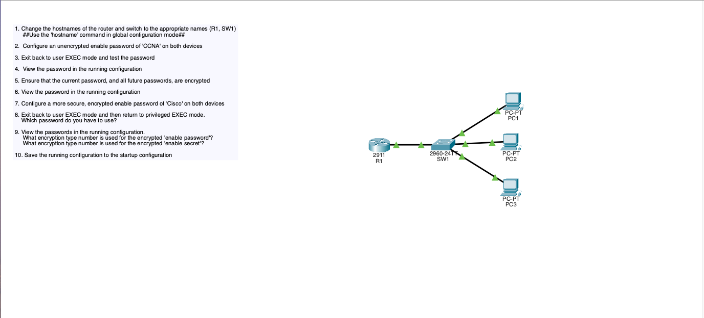
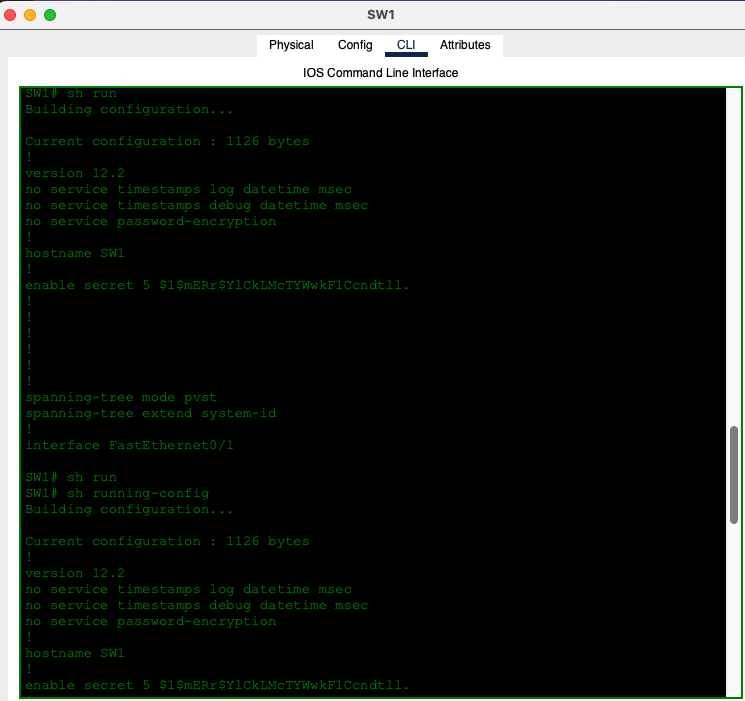

# 🔐 Lab 01 — Device Security

## 🎯 Objective
Implement basic device-level security controls to protect network infrastructure devices from unauthorized access.

---

## 🧠 Concepts Practiced
- Device hardening
- Password encryption
- Secure management access
- MD5 Encrytption

---

## 🛠️ Tools
- Cisco Packet Tracer
- Cisco IOS CLI

---

## 📸 Configuration Verification & Explanation

This was the Lab that I did, I was tasked with configuring the Router and Switch and I was asked to use specific commands to configure the passwords and the hostnames of the following devices

